# Vaxtrail Web App

## Introduction

Vaxtrail is an online vaccine booking or distribution system, helping users to tackle the current pandemic. It’s a completely online system which would promote digitization and even promote social distancing as slots for vaccination would be available at the nearest hospital <b>(within 2 kilometres of radius)</b> everyday thus reducing/ minimizing the risk of overcrowding.  

Our project will help to keep things in order, maintaining proper records. 

Users will be notified about their appointment using mail and SMS.
Also, developed a feature that gives priority to the senior citizens in the process, also they will be able to choose time slots as per their ease.

Users can (after 5 days of their vaccination give appropriate feedback) which can provide information about the effectiveness of vaccines.

## Technologies Utilised

It is MERN based project using MongoDB for database management, a popular NoSQL database management software, we will be using ReactJS for designing the front end and Express and Node JS for designing the backend, thus making it as a full stack project.

## Database Description

Utilised MongoDB for storing the data. Used 5 MongoDB collections to store and use the data accordingly.

<ul>
<li>Feedbacks -Stores the feedbacks of users.</li>
<li>Locations-Stores the details and coordinates of the hospitals.</li>
<li>Registereds- Stores the details of the registered users.</li>
<li>Users -Stores the details of admin login.</li>
<li>Vaccines-Stores the different vaccine details available in the country.</li>
</ul>

## Functionalities and Sneak Peak of the project

<b>Important Functionalities</b>

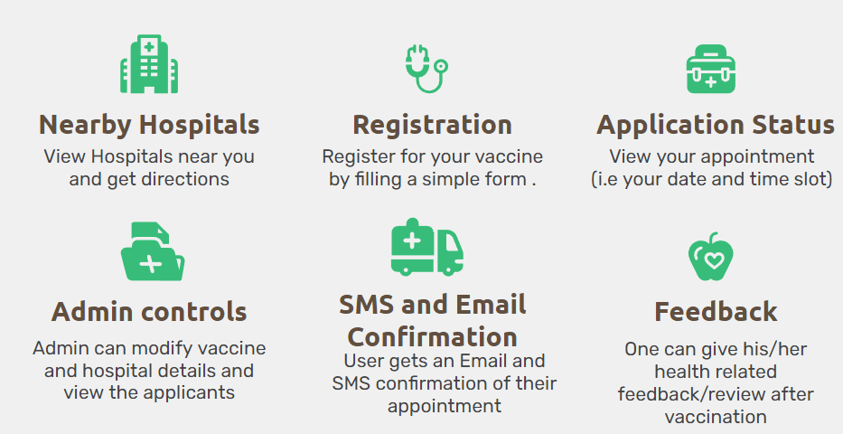

<b>Front Page</b>

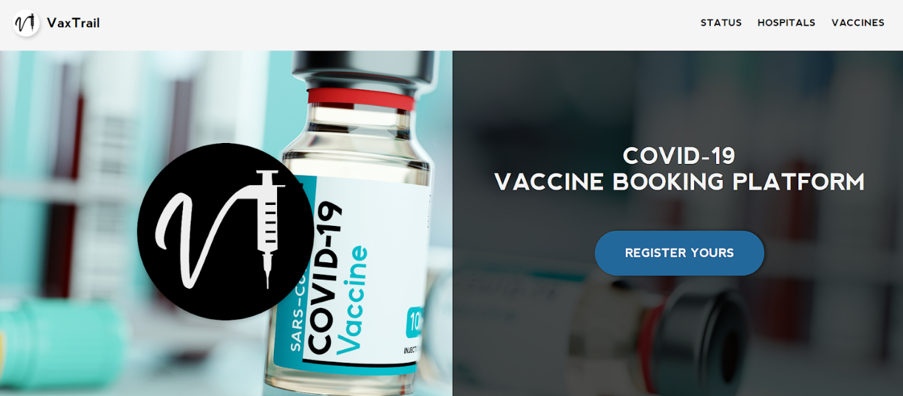
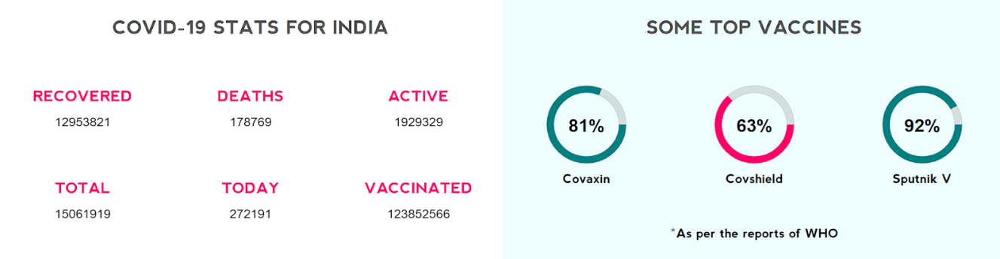
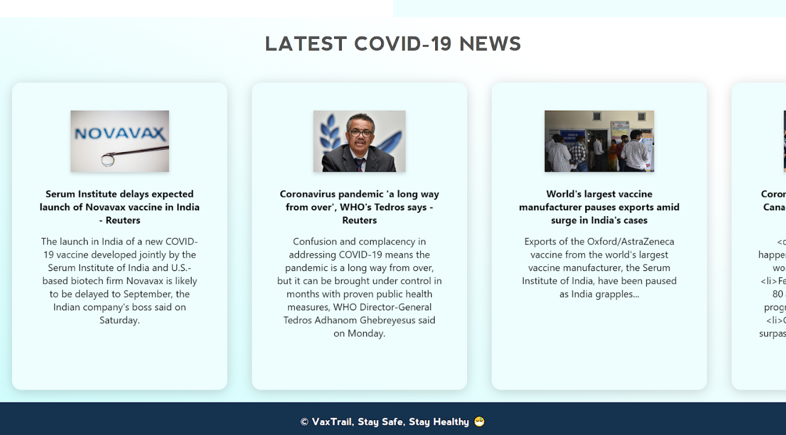

<b>Nearby Hospitals</b>

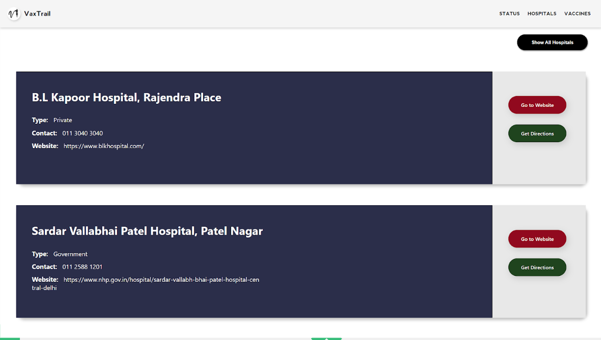

<b>Available Vaccines</b>

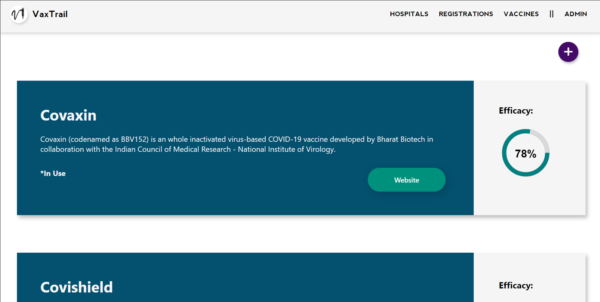

(User can add, edit or delete vaccines through the admin menu)

<b>Vaccine Registration and Application Status</b>

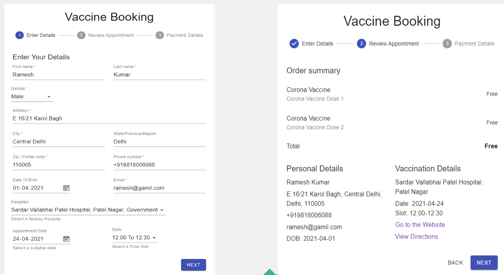
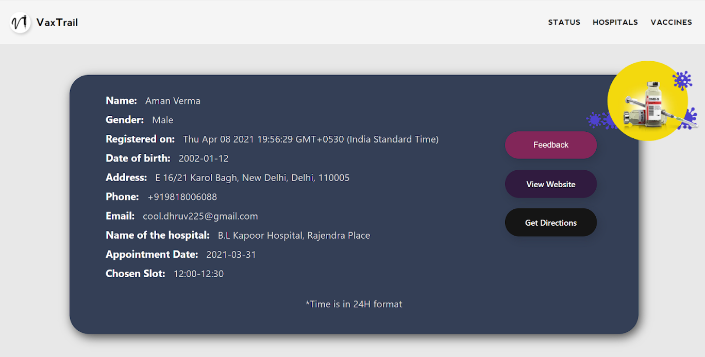

<b>Admin Menu</b>

Admin Sign in Page

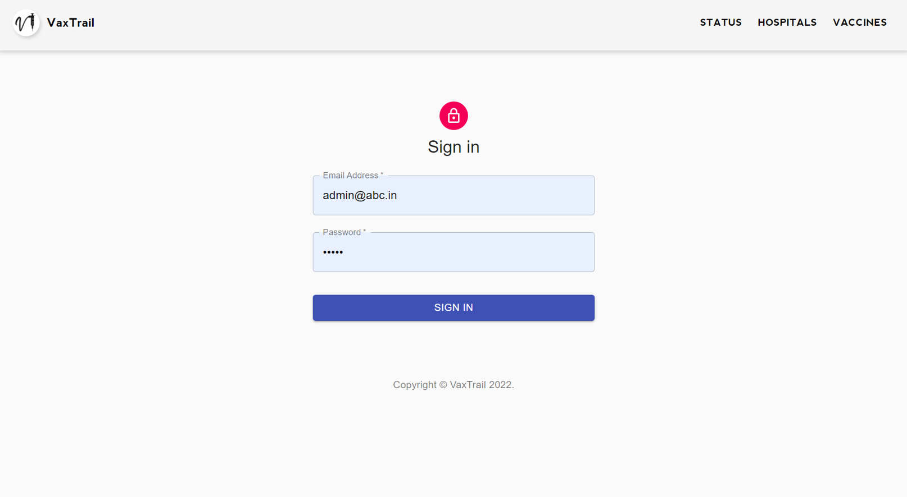

Admin can see all the registered users

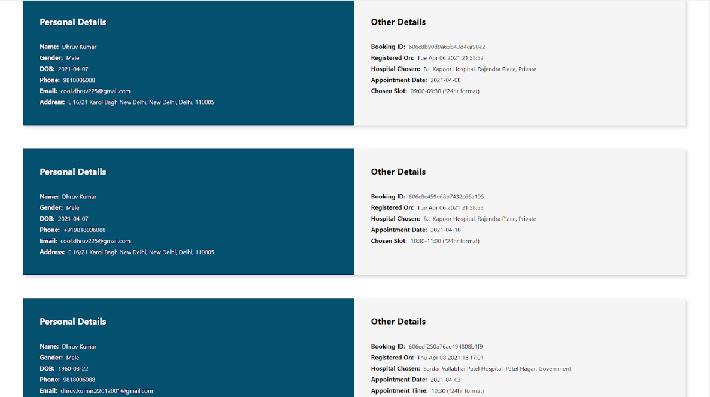

Admin can add, edit or delete the available hospitals/vaccines

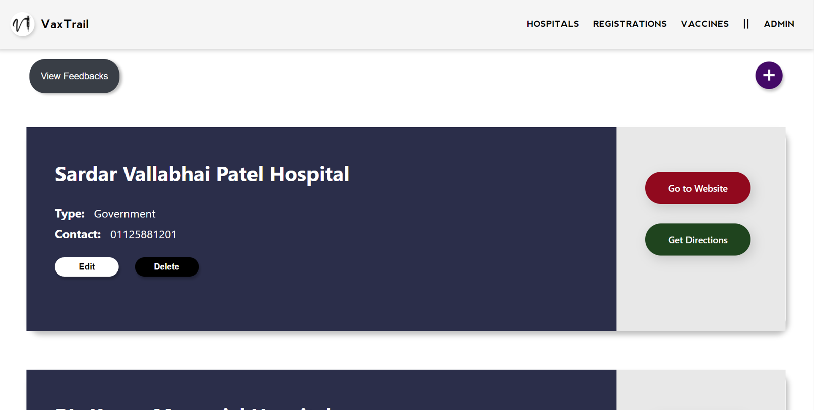
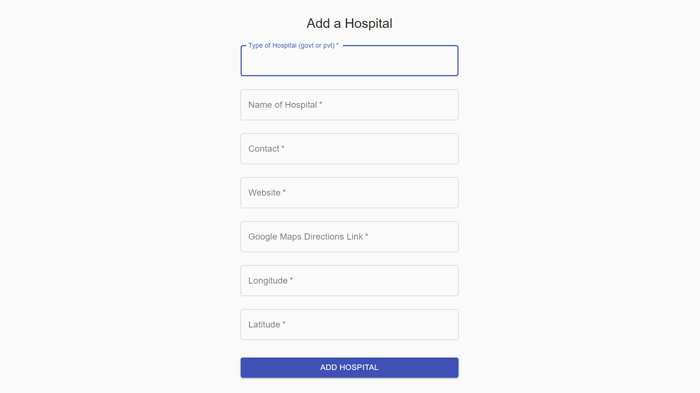
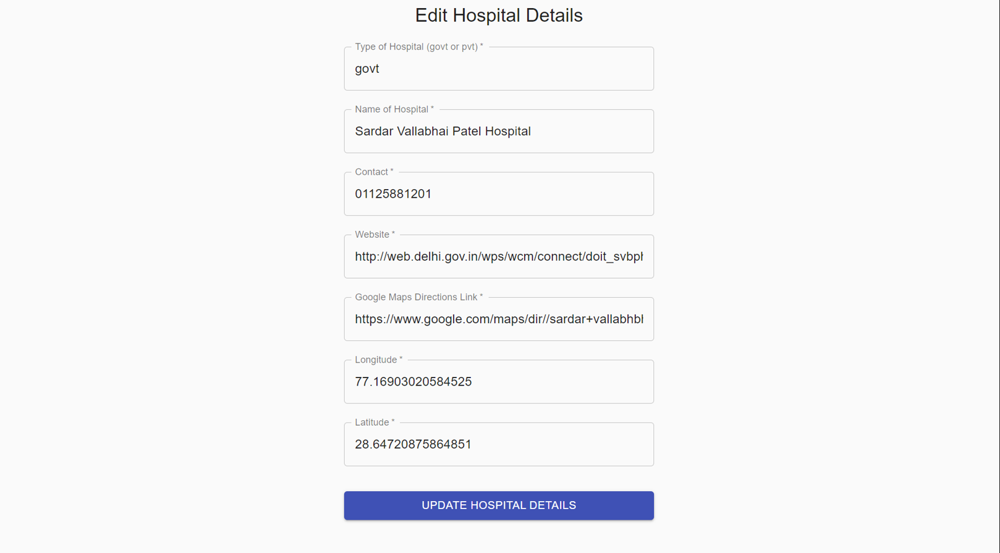
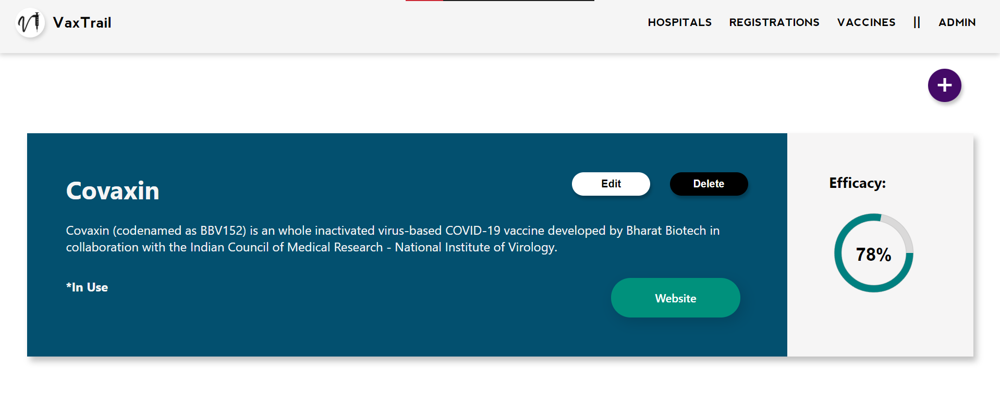

<b>Notifications after registration/cancellation</b>
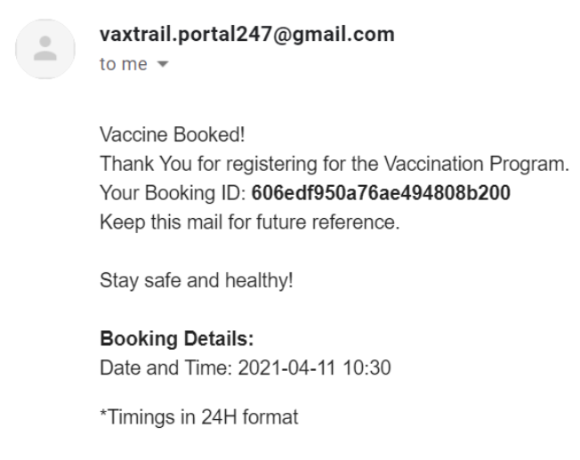
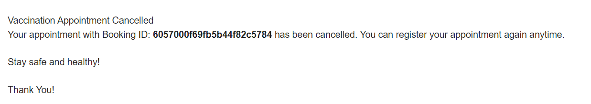
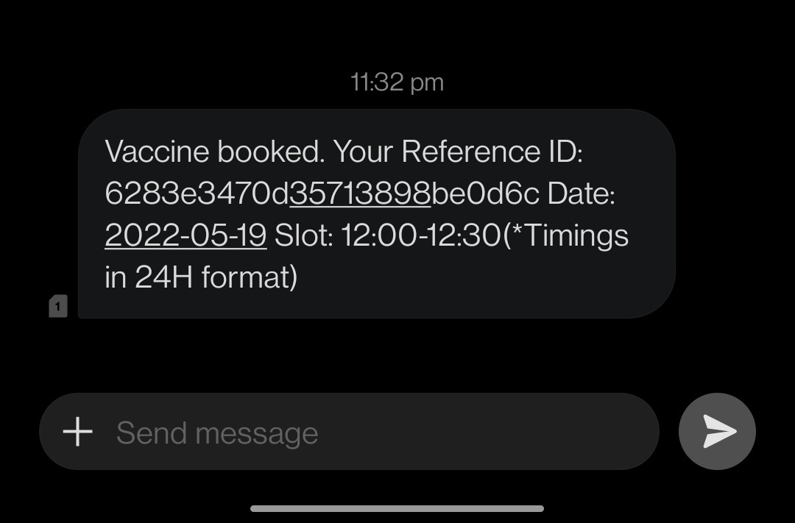
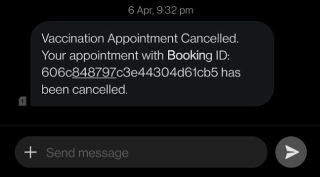

<b>Feedbacks</b>
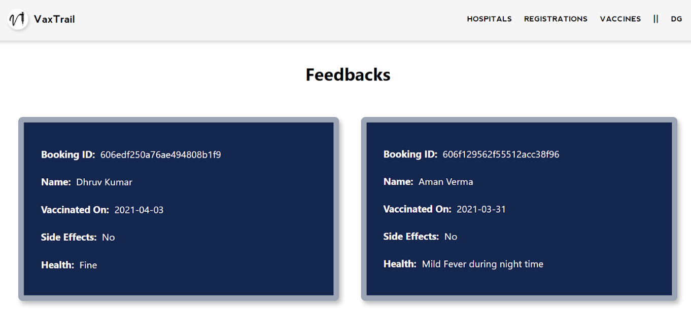